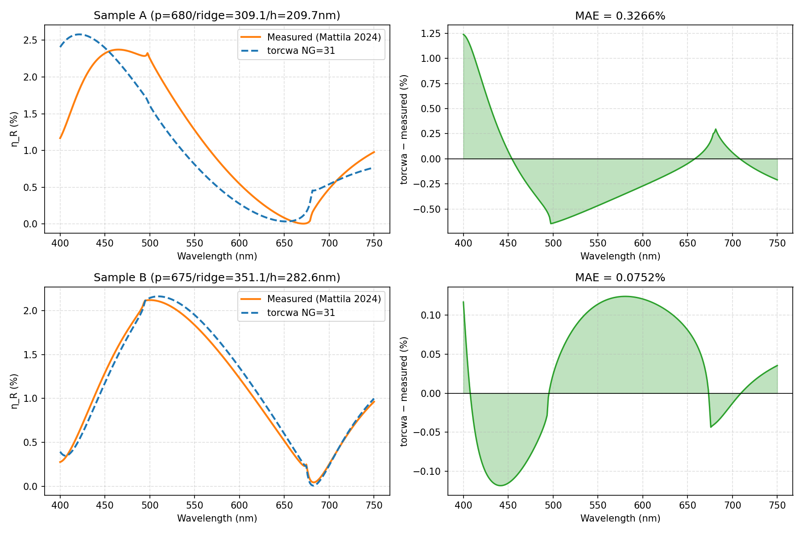

# torcwa RCWA 驗證報告

## 結論

**torcwa RCWA 模擬已通過實測資料驗證，可用於生成訓練資料。**

---

## 驗證依據

**論文**：Mattila et al., *Meas. Sci. Technol.* **35**, 085025 (2024)
"Artificial neural network assisted spectral scatterometry for grating quality control"

**結構**：SiO₂ 1D grating on SiO₂ substrate
**量測條件**：TE (s-pol)，正向入射，波長 400–750 nm
**資料來源**：公開資料集 https://doi.org/10.23729/7a9bbd75-7b8a-43d5-8c55-489f96e718b7

---

## 驗證結果

| 樣品 | Period | Ridge width | Height | MAE vs 實測 | 結果 |
|------|--------|-------------|--------|------------|------|
| Sample A (`d680_el300`) | 680 nm | 309.1 nm | 209.7 nm | **0.33 %** | ✅ PASS |
| Sample B (`d675_el330`) | 675 nm | 351.1 nm | 282.6 nm | **0.08 %** | ✅ PASS |

判定標準：MAE < 2% 即通過。

---

## 模擬設定

- 程式：`torcwa` v0.1.4.2（PyTorch GPU RCWA）
- Fourier orders：NG = 31（SiO₂ 低折射率差，NG=31 與 NG=101 差距 < 0.01%）
- 空間格點：NX = 65（需滿足 NX ≥ 2×NG+1）
- 光學常數：SiO₂ — Franta (refractiveindex.info)
- 驗證腳本：`validate_mattila2024.py`

---

## 驗證圖

---

*驗證日期：2026-05-23*
